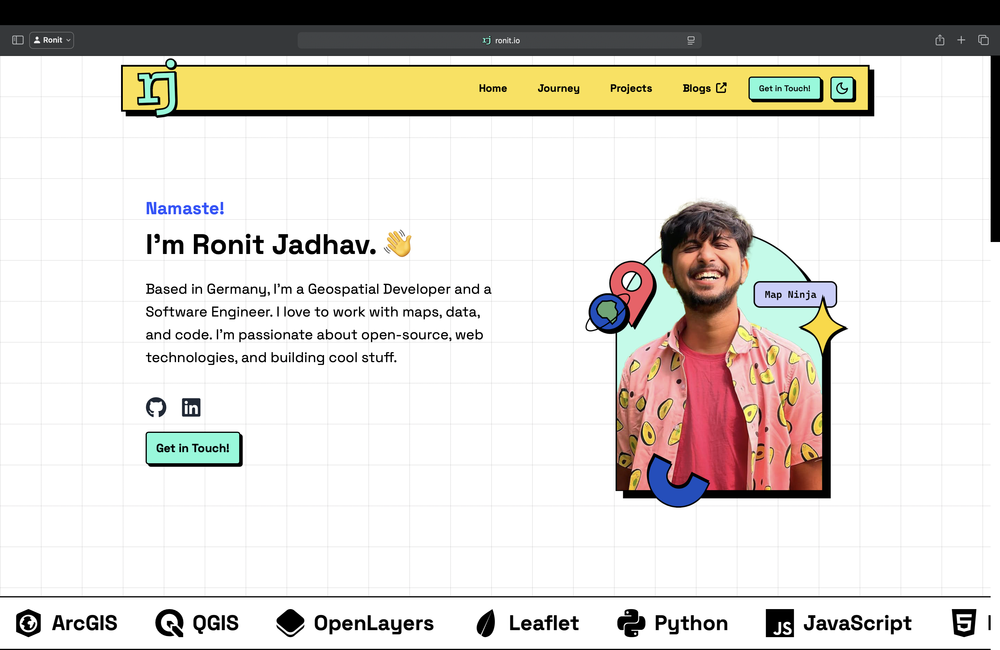
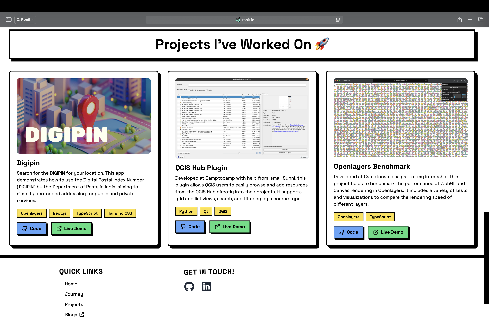

# Mudit.io

  

Welcome to my personal website!

## Table of Contents

- [About](#about)
- [Screenshots](#screenshots)
- [AI Chatbot](#ai-chatbot)
- [Getting Started](#getting-started)
- [Environment Variables](#environment-variables)
- [Features](#features)
- [Technologies Used](#technologies-used)
- [Deployment](#deployment)
- [Contributing](#contributing)
- [Contact](#contact)

## About

**ronit.io** is my personal website where I share my projects, blog posts, and more. It's built using [Next.js](https://nextjs.org) and styled with [Tailwind CSS](https://tailwindcss.com). The site is designed to be fast, accessible, and easy to maintain.

The website will feature an **AI-powered chatbot** (coming soon) that can answer questions about my professional background and experience, making it easy for visitors to learn more about my work and projects interactively.

## Screenshots

<!-- If you have screenshots, add them here -->
<!--  -->






## AI Chatbot (Coming Soon) 🚀

The website will feature an **AI-powered FAQ chatbot** that can answer questions about Ronit's professional background, projects, and experience.

> **Note**: The chatbot is currently disabled and shows "Coming Soon" on hover. It will be enabled once the site is deployed to a platform that supports server-side API routes (like Vercel or Netlify) instead of GitHub Pages.

### Planned Features:

- 🤖 **AI-Powered**: Will use Google Gemini API for intelligent responses
- 🛡️ **Anti-Abuse Protection**: reCAPTCHA verification to prevent spam and misuse
- 📱 **Responsive Design**: Will work seamlessly on desktop, tablet, and mobile
- 🎨 **Neobrutalism Theme**: Clean, minimal design matching the site aesthetic
- ⚡ **Quick Actions**: Pre-built suggestions for common questions
- 🔒 **Session-Based**: Verify once per session for smooth user experience

### How it will work:

1. Click the "Ask Ronit AI" button (currently shows "Coming Soon")
2. Complete reCAPTCHA verification (first-time only)
3. Chat with the AI about Ronit's experience, projects, and professional background
4. Get instant, contextual responses with suggested follow-up questions

The chatbot will operate in two modes:

- **With Gemini API**: Full AI capabilities with natural language understanding
- **Without API**: Falls back to curated FAQ responses for basic questions

### Security & Privacy:

- reCAPTCHA verification prevents automated abuse and spam
- No conversation data will be stored or logged
- API calls will be rate-limited and monitored
- All interactions will be session-based (no persistent data)

## Getting Started

To run the website locally, follow these steps:

1. **Clone the repository:**

```bash
git clone https://github.com/ronitjadhav/ronit.io.git
cd ronit.io
```

2. **Install dependencies:**

```bash
npm install
# or
yarn install
# or
pnpm install
```

3. **Set up environment variables:**

Copy the example environment file and add your API keys:

```bash
cp .env.example .env
```

Then edit `.env` with your actual values. See [Environment Variables](#environment-variables) section below for details.

4. **Run the development server:**

```bash
npm run dev
# or
yarn dev
# or
pnpm dev
```

5. **Open** [http://localhost:3000](http://localhost:3000) **in your browser to see the website.**

## Environment Variables

This project requires several environment variables to function properly. Copy `.env.example` to `.env` and fill in your values:

### Required for AI Chatbot (Coming Soon):

- `GEMINI_API_KEY` - Google Gemini API key for AI responses
  - Get from: [Google AI Studio](https://makersuite.google.com/app/apikey)
  - **Note**: Chatbot is currently disabled; will be enabled after deployment to Vercel/Netlify

### Required for Contact Form & Anti-Abuse:

- `NEXT_PUBLIC_GOOGLE_RECAPTCHA_SITE_KEY` - Google reCAPTCHA v2 site key
  - Get from: [Google reCAPTCHA Admin](https://www.google.com/recaptcha/admin/create)
- `NEXT_PUBLIC_EMAILJS_SERVICE_ID` - EmailJS service ID
- `NEXT_PUBLIC_EMAILJS_TEMPLATE_ID` - EmailJS template ID
- `NEXT_PUBLIC_EMAILJS_PUBLIC_KEY` - EmailJS public key
  - Get from: [EmailJS Dashboard](https://www.emailjs.com/)

### Required for Map Components:

- `NEXT_PUBLIC_MAPBOX_ACCESS_TOKEN` - Mapbox access token
- `NEXT_PUBLIC_MAPBOX_DARK_STYLE_URL` - Custom dark map style
- `NEXT_PUBLIC_MAPBOX_LIGHT_STYLE_URL` - Custom light map style
  - Get from: [Mapbox Account](https://account.mapbox.com/access-tokens/)

### Setup Instructions:

1. Copy environment file: `cp .env.example .env`
2. Fill in your API keys and tokens
3. Restart the development server

### Troubleshooting:

- **Chatbot not working**: Currently disabled (Coming Soon) - will be enabled after deployment to Vercel/Netlify
- **Contact form failing**: Verify `NEXT_PUBLIC_GOOGLE_RECAPTCHA_SITE_KEY` and EmailJS credentials
- **Maps not loading**: Ensure `NEXT_PUBLIC_MAPBOX_ACCESS_TOKEN` is valid
- **reCAPTCHA issues**: Confirm domain is registered in Google reCAPTCHA admin

## Features

- **🤖 AI Chatbot (Coming Soon):** Interactive FAQ assistant powered by Google Gemini API with anti-abuse protection
- **📧 Contact Form:** Secure contact form with reCAPTCHA verification and EmailJS integration
- **🗺️ Interactive Maps:** Custom Mapbox integration with light/dark theme support
- **📱 Responsive Design:** Optimized for desktop, tablet, and mobile devices
- **🎨 Neobrutalism Theme:** Clean, minimal design with bold shadows and borders
- **🌙 Dark Mode:** Full dark/light theme support with system preference detection
- **⚡ Performance:** Built with Next.js 15 and optimized for speed
- **♿ Accessibility:** WCAG compliant with proper ARIA labels and keyboard navigation
- **🔍 SEO Optimized:** Built-in SEO best practices with meta tags and sitemaps
- **📊 Projects Showcase:** Detailed project portfolio with descriptions and live links

## Technologies Used

- **Next.js 15:** React framework with App Router and Turbopack for fast development
- **TypeScript:** Strongly typed JavaScript for better development experience
- **Tailwind CSS:** Utility-first CSS framework for rapid UI development
- **Google Gemini API:** Advanced AI for intelligent chatbot responses
- **Mapbox:** Interactive maps with custom styling
- **EmailJS:** Client-side email sending for contact forms
- **Google reCAPTCHA:** Bot protection and spam prevention
- **Lucide React:** Beautiful, customizable icon library
- **Next Themes:** Dark/light theme management
- **React Google reCAPTCHA:** reCAPTCHA integration for React

## Deployment

This site can be easily deployed to platforms like [Vercel](https://vercel.com/) or [Netlify](https://www.netlify.com/).

### Environment Variables for Production:

When deploying, make sure to add all environment variables from `.env.example` to your deployment platform:

- Vercel: Project Settings → Environment Variables
- Netlify: Site Settings → Environment Variables

### Build Commands:

```bash
npm run build
npm start
```

### Important Notes:

- All `NEXT_PUBLIC_*` variables are exposed to the client-side
- Keep server-side variables (like `GEMINI_API_KEY`) secure and never expose them
- Test all features (chatbot, contact form, maps) after deployment
- Ensure your domain is registered with Google reCAPTCHA for production

## Contributing

Contributions are welcome! If you have suggestions, bug reports, or want to add features, please open an issue or submit a pull request.

1. Fork the repository
2. Create your feature branch (`git checkout -b feature/YourFeature`)
3. Commit your changes (`git commit -m 'Add some feature'`)
4. Push to the branch (`git push origin feature/YourFeature`)
5. Open a pull request

## Contact

You can reach me at [hi@ronit.io](mailto:hi@ronit.io)

Thank you for visiting my website!
